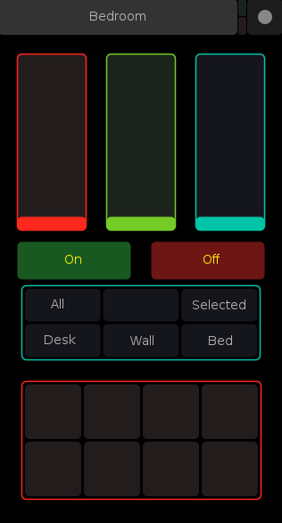

<style type="text/css">
img[src*='#center'] { 
    display: block;
    margin: auto;
}
</style>
# Masochistic Lighting Automation
Why buy perfectly affordable smart bulbs that are easy to install and come with all sorts of control when you can spend way too much money on DMX lights and waste countless hours getting them to work with a bare-bones TouchOSC controller?

## Usage 
Currently just a brief walk through of the code, more to come later.

### Touch OSC Interface
 The interface I'm using is in `assets/osc-surface.touchosc`
 
 

* The faders on top are RGB controls for whatever lights you currently have selected.
* On and Off buttons set the brightness to all the way up, or completely off
* The labeled multi-toggle lets you choose which lights to control. 
    * **All** All the lights
    * **Selected** Lights selected in multi-toggle beneath this one
    * **The Rest** Specific Groups configured for the Scene, details on that later. 
* The final multi-toggle at the bottom allows you to select specific lights to control, to use it select a few of the toggles, and select the **Selected** option from the multi-toggle above. Be sure to set one of the faders after you've done this.

It's worth noting that this is kind of a clunky interface. The button state won't always reflect what's actually going on with your setup after you've switched around a bit, which is a tad confusing at first. Poke at it for a bit before throwing your phone at the wall and ragequitting.  

### run.py
Pretty barebones run file, there should only be a few things in here you might need to tweak

#### OSC Server IP/Port Settings
You'll need to update the IP Address for the osc server on this line to match your machines IP
```python
osc_server_ip = "192.168.0.33"
osc_server_port = 5005
```
Also make sure to Update the settings on your OSC device. 
* OSC Host should be the same as your IP set above
* OSC Port(outgoing) should be set to 5005 (or whatever you change it to)

### Scene Definition
To define a Scene, make a new class in `masochisticlighting/scenes/yourroom.py`. This is where you'll define your Fixtures and Fixture Groups, and define the mappings for the OSC UI. Once that's built, simply swap out the constructor
```python
# Build the scene
scene = Yourroom(Controller(controller_address))
``` 

#### Controller Address
```python
controller_address = '/dev/ttyUSB0'
```

`/dev/ttyUSB0` here refers to the address of the EntTec USB Pro plugged into your machine. 

This setting should work if you're running linux, but to figure out what the value should be you can use the lovely utility created by the [author of the DMXEnttecPro module](https://github.com/SavinaRoja). 

I've shamelessly [stolen the following from their documentation](https://pypi.org/project/DMXEnttecPro/)

##### Stolen Documentation
If you don't know the serial address of the DMX controller yet, you can do the following to identify it:

`python -m DMXEnttecPro.utils`

which will give you some detailed information on all COM ports like this:

```
COM4
  name: None
  description: USB Serial Port (COM4)
  hwid: USB VID:PID=0403:6001 SER=EN055555A
  vid: 1027
  pid: 24577
  serial_number: EN055555A
  location: None
  manufacturer: FTDI
  product: None
  interface: None
```
Once you know your serial address, setting up a connection to your Enttec DMX USB Pro is simple:

```python
from DMXEnttecPro import Controller
#dmx = Controller('COM4')  # Typical of Windows
dmx = Controller('/dev/ttyUSB0')  # Typical of Linux
```


#### define_fixtures()

Assuming you're working with the same cheapo fixtures I am, it's as simple as adding a function to your room class adding each of the fixtures by DMX address like so 

```python
class Yourroom(Scene):
    def define_fixtures(self):
        self.add_fixture(Cheap(1))
        self.add_fixture(Cheap(6))
        self.add_fixture(Cheap(11))
        self.add_fixture(Cheap(21))
        self.add_fixture(Cheap(26))
        self.add_fixture(Cheap(31))
        self.add_fixture(Cheap(36))
        self.add_fixture(Cheap(41))
```
Each of these fixtures has 4 channels, and I'm putting a single address gap between each one. There's a gap at address 16 for reasons I don't particularly care to re-live at this moment, but whatever addresses you choose should work fine. 

#### define_groups()
```python
class Yourroom(Scene): 
    def define_groups(self):
        self.add_group('one_group', [1, 6, 11])
        self.add_group('another_group', [21, 26, 31, 41])
        self.add_group('yet_another_group', [36])
```
Define any light groupings you want here, using the addresses for the lights set in `define_fixtures()`. Nothing fancy here. 

#### osc_group_mappings()
Now that groups are defined, you can map the groups to their respective toggles in the OSC interface. Just define a list with group names corresponding to the buttons in the OSC interface.

```python
class Yourroom(Scene):
    def osc_group_mappings(self):
        self.group_mappings = [
            'one_group', 'another_group', 'yet_another_group'
        ]
```

#### osc_select_mappings(): 
Here you'll map the actions of the select toggles (second OSC mult-toggle) to specific fixtures. This is a straightforward list definition, each entry corresponds to it's toggle on the osc interface
```python
class Yourroom(Scene):
    def osc_select_mappings(self):
        self.select_mappings = [
            [ 1,  6, 11, 21],
            [31, 26, 41, 36]
        ]
```


## Random Info

### Software
| Name | Blurb |
|---|---|
|[TouchOSC Editor](https://hexler.net/products/touchosc)|DIY Control Surface on your phone/tablet/whatever| 
|[QLC+](https://www.qlcplus.org/)|Software for controlling DMX lighting systems. Really helpful for wrapping your head around how DMX works in general, and how to address your lights appropriately|
|[Enttec Pro Manager](https://www.enttec.com/product/controls/dmx-lighting-control-software/pro-manager/)|Configuration/Testing utility from Enttec. It's clunky and prone to crash, but really useful for getting your USB interface up and running, and there's nice test-send feature that lets you check your physical install without having to jump through too many hoops. |
|[DMX Enttec Pro module](https://pypi.org/project/DMXEnttecPro/)| Blissfully straightforward interface to control DMX lights over the DMX Pro. Check out their docs for help figuring out what interface address to attach to.|
|[Python OSC Module](https://pypi.org/project/python-osc/)|For listening to control messages from the OSC Controller above. The bare-bones example they give in the docs is more than enough to get up and running.| 

### Equipment 
| Name | Blurb |
|---|---|
|  <br/>[ENTTEC DMX USB Pro](https://www.enttec.com/product/controls/dmx-usb-interfaces/dmx-usb-interface/)| For connecting to your DMX lights. There are cheaper options out there that probably work just as well, but I chickened out and went with this guy.|  
|  <br/>[5 to 3 pin DMX Converter](https://www.amazon.com/CHAUVET-DJ-Lighting-Black-DMX3F5M/dp/B00180UNI0)|I foolishly assumed I wouldn't need this. <br/>I **definitely** did.|
|  <br/> [Dodgy DMX Par Lights (8-pack)](https://www.amazon.com/gp/product/B01N2NIOTR) | $15 a pop, you get what you pay for| 
|  <br/> [Bulk DMX Cables (20-pack)](https://www.amazon.com/gp/product/B00VRBWJ0U)| They haven't set anything on fire so far!|
|  <br/>[Ilegal Mezcal](https://www.ilegalmezcal.com/product/joven/)|Delicious **and** sanity-preserving|

### Dip Switch Config for Dodgy Par Lights
|Channel |Data |Function |
| --- | --- | --- |
|1|0|Turn Off|
|1|1-127|Brightness|
|1|128-250|Strobe Intensity|
|1|251-255|Also brightness I guess? <br/>Doesn't seem to do anything<br/>but turn the lights on|
|2|0-255| Red |
|3|0-255| Green|
|4|0-255| Blue|

 