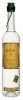
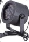

# Masochistic Lighting Automation
Why buy perfectly affordable smart bulbs that are easy to install and come with all sorts of control when you can spend way too much money on DMX lights and waste countless hours getting them to work with a bare-bones TouchOSC controller?
### Software
#### [TouchOSC Editor](https://hexler.net/products/touchosc)
DIY Control Surface on your phone/tablet/whatever
Faders are for Red/Green/Blue channels, on and off buttons do what you'd expect

#### [DMX Enttec Pro module](https://pypi.org/project/DMXEnttecPro/)
Blissfully straightforward interface to control DMX lights over the DMX Pro. Check out their docs for help figuring out what interface address to attach to.
#### [Python OSC Module](https://pypi.org/project/python-osc/)
For listening for control messages from the OSC Controller above. The bare-bones example they give in the docs is more than enough to get up and running. 
### Equipment 
#### [Liquid Courage (2 bottles minimum)](https://www.ilegalmezcal.com/product/joven/)
This stuff is just delicious.

#### [ENTTEC DMX USB Pro](https://www.enttec.com/product/controls/dmx-usb-interfaces/dmx-usb-interface/)
There are cheaper options out there that probably work just as well, but I chickened out and went with this guy. 

#### [5 to 3 pin DMX Converter](https://www.amazon.com/CHAUVET-DJ-Lighting-Black-DMX3F5M/dp/B00180UNI0)
I foolishly assumed I wouldn't need this. 

I Definitely did.

#### [Dodgy DMX Par Lights (8-pack)](https://www.amazon.com/gp/product/B01N2NIOTR)
$15 a pop, you get what you pay for

|Channel |Data |Function |
| --- | --- | --- |
|1|0|Turn Off|
|1|1-127|Brightness|
|1|128-250|Strobe Intensity|
|1|251-255|Also brightness I guess?  Doesn't seem to do anything but turn the lights on|
|2|0-255| Red |
|3|0-255| Green|
|4|0-255| Blue|

#### [Bulk DMX Cables (20-pack)](https://www.amazon.com/gp/product/B00VRBWJ0U)
Haven't set anything in my house  on fire yet!!!!

